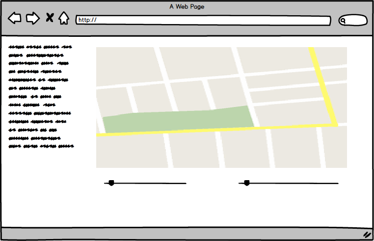

# Traveling Salesman

The traveling salesman problem is a. I will implement an algorithm using simulated annealing to solve a traveling salesman problem and visualize the results.

## MVP Features

- [ ] Ability to set certain parameters of the algorithm
- [ ] Select points on  map to be optimized
- [ ] Choose a preset demo of points on the map
- [ ] A production readme
- [ ] A description describing the funcitonality and techniques and the meaning of the different parameters

## Wireframes

The app will consist of a single screen with a map and several inputs.

This project will be implemented with the following technologies:

- Vanilla JavaScript for algorithm and basic structure,
- `Easel.js` with `HTML5 Canvas` for DOM manipulation and rendering,
-  Webpack to bundle and serve up the various scripts.

## Implementation Timeline

**Day 1**: Setup all necessary Node modules, including getting webpack up and running and `Easel.js` installed.  Create `webpack.config.js` as well as `package.json`. 

- Get a simple canvas with map image and clickable placement

**Day 2**: Measure distance between points on the canvas and calculate total distance betwee series of points.

**Day 3**: Create the algorithm logic backend.

- Have a working algorithm that gives a good close estimate of the shortest route between all points.
- Begin animation of paths between points on the canvas.

**Day 4**: Install the controls for the user to interact.  Style the frontend, making it polished and professional.  Goals for the day:

- Create controls for speed, stop, start, reset
- Make the animation of the changing points look good.

