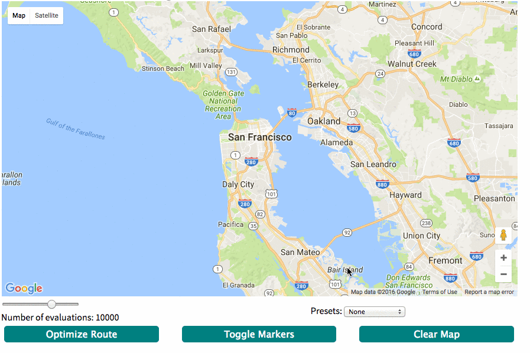

# Traveling Salesman

The traveling salesman problem is a classic computer science problem. This app utilizes an algorithm using simulated annealing to quickly find one of the shortest routes. The app comes with some preset routes for the user to try out.

## Paint By Algorithm

In addition to the mapping functionality the page inludes a second tab which uses the same algorith and a canvas to create interesting shape and color combinations.